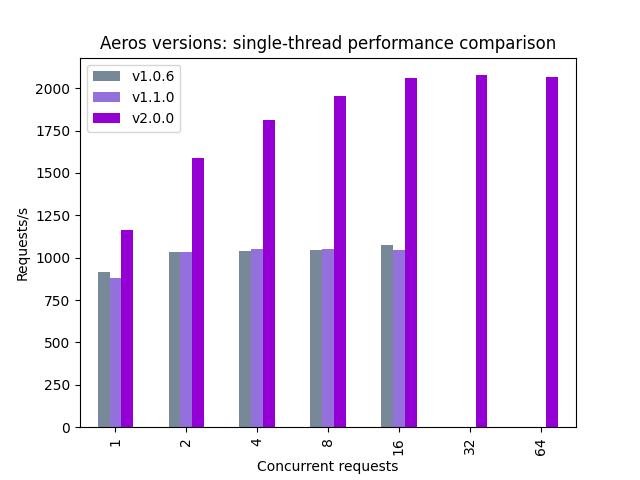
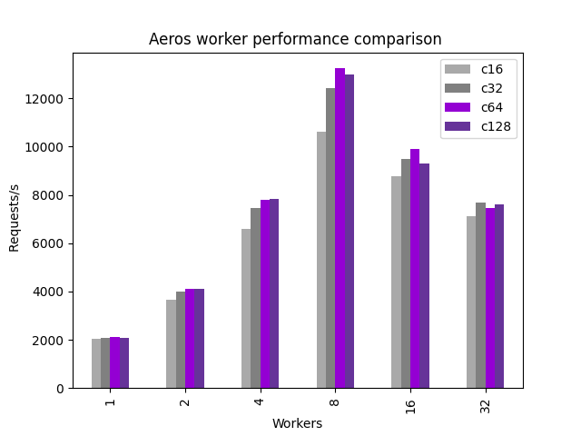

<p align="center">
  
  
  
  
  
  
</p>

# Python package [documentation](https://aeros.readthedocs.io/en/latest/)

[Aeros](https://pypi.org/project/Aeros/) is an all-in-one ASGI (Asynchronous Server Gateway Interface) package containing wrappers for widely used Web and API functions, as well as
custom-written helper functions which make backend development a lot easier and require way less code than a native implementation using the featured packages would.

It is primarily meant to simplify backend server development with Python by bundling APIs for multiple modules, such as `quart`, `flask-caching`, `quart-compress`, `uvicorn` and
some more. While you can focus on developing your backend with one streamlined package, Aeros takes care of dependencies and compatibility.

## Features

- High-performance web server
    - Async request handling
    - Supports multi-threading
- Production-grade ASGI (async WSGI)
- In-Python code API
- Native server-side caching
- Native gzip compression
- Easy client-side caching (cache-control header)
- Easy Framework based on Flask/Quart
- Custom global headers (like CORS etc.)
- Colored logging output
- Detailed access logs

### Why use Aeros over Flask and Quart?

A detailed overview of pros and cons can be found here:

| Feature               | Aeros           |     | Flask           | Flask + Waitress | Flask + Gunicorn | Quart           |Quart + Hypercorn  |
|:----------------------|:---------------:|:---:|:---------------:|:----------------:|:----------------:|:---------------:|:-----------------:|
| In-Python API         |  |     |  |   |   |  |    |
| Easy to use           |  |     |  |   |                  |  |                   |
| Production-grade      |  |     |                 |   |   |                 |    |
| Asynchronous          |  |     |                 |                  |                  |  |    |
| Multiple workers      |  |     |                 |   |   |  |    |
| Callable from thread  |                 |     |  |   |                  |                 |                   |
| Native caching        |  |     |                 |                  |                  |                 |                   |
| Native compression    |  |     |                 |                  |                  |                 |                   |
| Native CORS support   |  |     |                 |                  |                  |                 |                   |
| Cache-Control API     |  |     |                 |                  |                  |                 |                   |

## Parameter & Statistics

| Parameter            | Recommended  | Min     | Max    |
|:---------------------|-------------:|--------:|-------:|
| Worker threads       | 8            | 1       | ?      |
| Concurrent requests  | 64           | 1       | ?      |
| Worker threads       | 8            | 1       | ?      |

The following graph shows the overall performance improvement since version 1.0.6. The replacement of Aeros backend in version 2.0.0 is clearly visible as a boot in single-thread
performance.



The graph below shows the obtained response rates for multiple worker configurations. For most devices, a total of **8 workers and 64 concurrent requests** will extract the largest
amount of performance from the hardware. Everything above will actually slow the service down, since it has to do a lot of load balancing and negotiation between the workers. When
accepting more concurrent requests, the server queues them up for execution by one of the workers, so the more, the better. But, after 64 concurrent requests at once, the server
will again have to deal with a lot of load balancing and will eventually loose performance. So a total of 64 concurrent requests is recommended.



## Getting started

This basic code snippet should get you ready for more. Remember that routed methods
(the ones that are called on an HTTP endpoint) must be defined with `async def`, not `def`!

```python
from Aeros import WebServer
from quart import jsonify

app = WebServer(__name__, host="0.0.0.0", port=80)


@app.route("/")
async def home():
    return jsonify({"response": "ok"})


if __name__ == '__main__':
    app.run_server()
```

## Full Documentation

### Using sync methods in async methods

If you need to execute a synchronous method in an HTTP request handler and need to wait for its response, you should use `sync_to_async` from `asgiref.sync`. This method can also
be imported from `Aeros.misc`:

```python
from Aeros.misc import sync_to_async
import time


@sync_to_async
def sync_method():
    time.sleep(2)
    return "ok"


@app.route("/")
async def home():
    status = sync_method()
    return jsonify({"response": status})
```

### Starting a server in a separate thread

Quart and Hypercorn don't allow server instances to be started from a non `__main__` thread. Aeros however does. This code shows how:

```python
from Aeros import WebServer
from Aeros import AdvancedThread
from threading import Thread
import time

app = WebServer(__name__, host="0.0.0.0", port=80, worker_threads=2)

...

if __name__ == '__main__':
    t = AdvancedThread(target=app.run_server, daemon=True)
    # OR
    t = Thread(target=app.run_server, daemon=True)

    t.start()
    time.sleep(120)
    t.stop()  # only available in AdvancedThread, not in Thread
```

### Headers

#### Adding custom global headers

You can define headers, which will be sent on every response, no matter the response type.

```python
from Aeros import WebServer

app = WebServer(__name__, global_headers={"foo": "bar"})

...
```

#### Remove the `server` header

The `server` header can be removed on initialization:

```python
from Aeros import WebServer

app = WebServer(__name__, include_server_header=False)

...
```

### Caching

By default, `WebServer()` has no cache configured. You can choose between multiple cache types to start your server instance with:

| Cache Type          | Description |
|---------------------|-------------|
| `SimpleCache()`     | Easy to set-up, not very stable with multiple worker threads.
| `FilesystemCache()` | Stores every unique request in a separate file in a given directory.
| `RedisCache()`      | Stores cached objects on a given Redis server.

Here, the most basic example

```python
from Aeros import WebServer
from asyncio import sleep
from Aeros import SimpleCache

cache = SimpleCache(timeout=10,  # Cache objects are deleted after this time [s]
                    threshold=10  # Only 10 objects are stored in cache
                    )

app = WebServer(__name__, host="0.0.0.0", port=80, worker_threads=4, cache=cache)


@app.route("/")
@app.route("/<path:path>")
@app.cache()
async def index(path=""):
    print(path)
    if path != "favicon.ico":
        await sleep(5)
    return "test"


if __name__ == '__main__':
    app.run_server()
```

### Compression

Aeros supports gzip compression, which is enabled by default (for all text-based files >500 bytes, with compression level 2). You can customize these compression settings by
default

```python
from Aeros import WebServer, Compress, AdvancedThread
import time

# For more information:
# https://github.com/colour-science/flask-compress

app = WebServer(__name__, host="0.0.0.0", port=80, worker_threads=2, )
app.config["COMPRESS_MIN_SIZE"] = 5  # size in bytes
app.config["COMPRESS_LEVEL"] = 2  # compresses to about 25% of original size
app.config["COMPRESS_MIMETYPES"] = [  # compresses all text-based things
    'text/plain',
    'text/html',
    'text/css',
    'text/scss',
    'text/xml',
    'application/json',
    'application/javascript'
]

Compress(app)


@app.route("/")
async def home():
    return "testing again..."


if __name__ == '__main__':
    t = AdvancedThread(target=app.run_server, daemon=True)

    t.start()
    time.sleep(120)
    t.stop()  # only available in AdvancedThread, not in Thread

```
